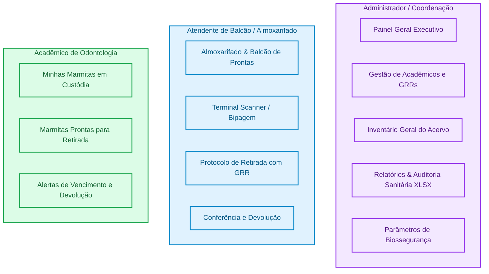
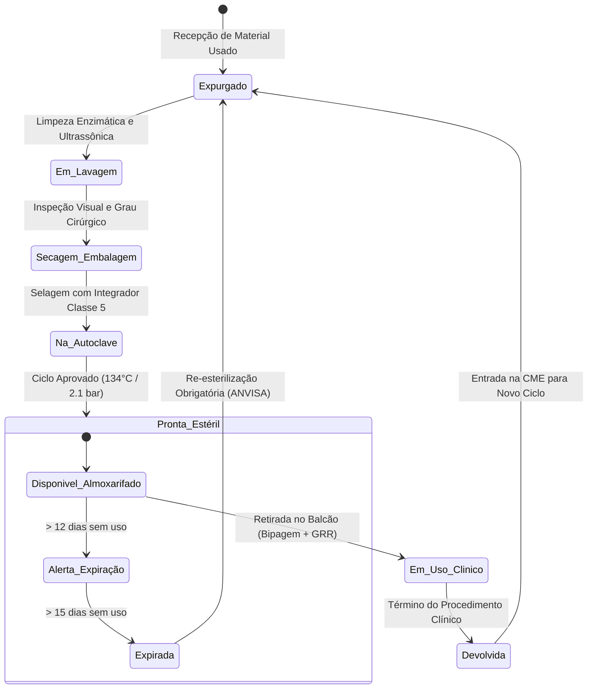
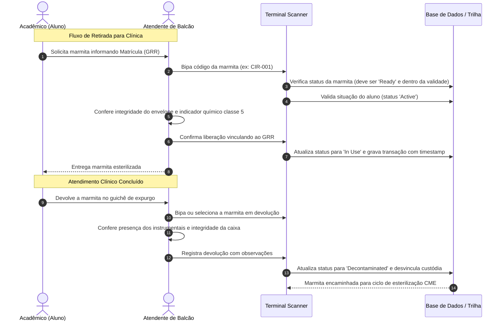
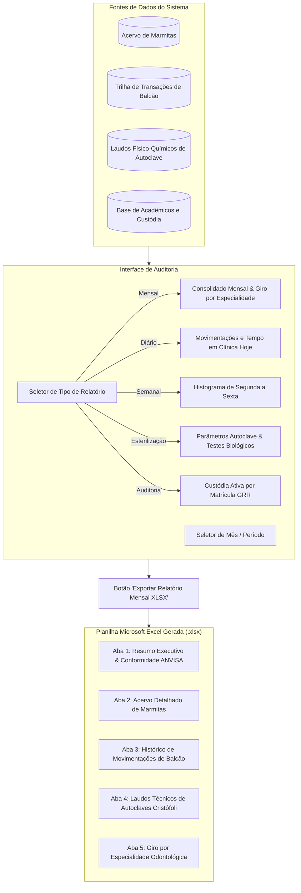

# LabControl - Sistema de Gestão e Rastreabilidade de Marmitas Odontológicas

O **LabControl** é uma plataforma institucional para controle de acervo, biossegurança e rastreabilidade de caixas cirúrgicas e estojos instrumentais (**"marmitas"**) em clínicas odontológicas universitárias. O sistema assegura conformidade estrita com as normas da **ANVISA (RDC 15/2012)** e organiza os fluxos operacionais entre a Central de Esterilização (CME), o Almoxarifado/Balcão de Atendimento, os Acadêmicos e a Coordenação/Administração.

---

## 1. Visão Geral dos Perfis e Permissões (RBAC)

O sistema possui controle de acesso baseado em papéis para evitar duplicidade de funções e garantir integridade nos registros:



### Matriz de Responsabilidades

| Perfil | Escopo e Acessos | Ações Exclusivas |
| :--- | :--- | :--- |
| **Administrador** *(Coordenação de Biossegurança)* | Gestão estratégica, governança, acervo patrimonial e auditoria. | Cadastrar/editar acadêmicos, definir parâmetros RDC 15, auditar extravios e exportar laudos em planilha **.XLSX**. |
| **Atendente de Balcão** *(Almoxarifado)* | Operação direta de atendimento e guichê de atendimento clínico. | Bipagem no scanner, conferência visual de envelopes grau cirúrgico, liberação de retirada e recebimento de devolução. *(Sem acesso a cadastro de alunos)*. |
| **Acadêmico** *(Estudante)* | Consulta pessoal das marmitas em sua posse e acervo estéril. | Visualizar tempo restante de validade estéril, histórico próprio de retiradas e localização de marmitas prontas no estoque. |

---

## 2. Ciclo de Vida da Marmita Odontológica

Toda marmita cirúrgica transita por estados bem definidos para garantir a esterilidade dos instrumentais e a segurança do paciente:



---

## 3. Fluxo Operacional: Retirada e Devolução no Balcão

O processo de liberação e devolução ocorre via Terminal Scanner com registro instantâneo de custódia:



---

## 4. Fluxo de Auditoria Sanitária e Exportação XLSX

Para inspeções de vigilância sanitária e fechamentos de mês da faculdade, a aba **Relatórios & Auditoria** processa os dados clínicos e gera planilhas analíticas:



---

## 5. Estrutura de Pastas e Componentes do Projeto

```text
src/
├── components/
│   ├── DashboardView.tsx          # Painel executivo do Administrador (KPIs, custódia e biossegurança)
│   ├── StudentManagementView.tsx  # Cadastro e gestão de acadêmicos (acesso exclusivo Admin)
│   ├── KitInventoryView.tsx       # Inventário patrimonial completo das marmitas
│   ├── ReportsView.tsx            # Relatórios dinâmicos e motor de exportação XLSX (SheetJS)
│   ├── SettingsView.tsx           # Configuração de prazos e parâmetros sanitários
│   ├── ReceptionCounterView.tsx   # Almoxarifado e Balcão de atendimento
│   ├── WithdrawalProtocolView.tsx # Terminal de Scanner e conferência de integridade
│   ├── StudentPortalView.tsx      # Espaço do Acadêmico (Minhas Marmitas e Marmitas Prontas)
│   ├── Header.tsx                 # Cabeçalho com seletor único de perfil no canto superior direito
│   ├── Sidebar.tsx                # Menu lateral adaptativo conforme papel ativo
│   └── RoleSwitcherModal.tsx      # Modal de alternância de usuário
├── data/
│   └── mockData.ts                # Base de dados clínicos, marmitas, ciclos de autoclave e alunos
├── types.ts                       # Tipagem TypeScript centralizada do sistema
├── App.tsx                        # Roteamento de abas e controle de estado global
└── main.tsx                       # Ponto de entrada da aplicação
```

---

## 6. Principais Tecnologias Utilizadas

- **React 18** com **TypeScript**
- **Vite** para compilação ágil
- **Tailwind CSS** para estilização técnica e acessível (Design System baseado em tons neutros, estados de alta legibilidade e sem excesso de gradientes)
- **SheetJS (xlsx)** para geração nativa de planilhas Excel `.xlsx` no navegador do cliente
- **Material Symbols Outlined** para iconografia técnica de saúde e biossegurança
